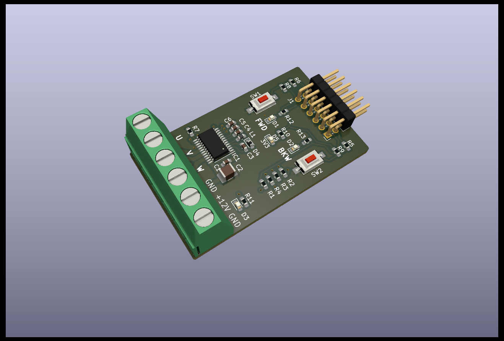
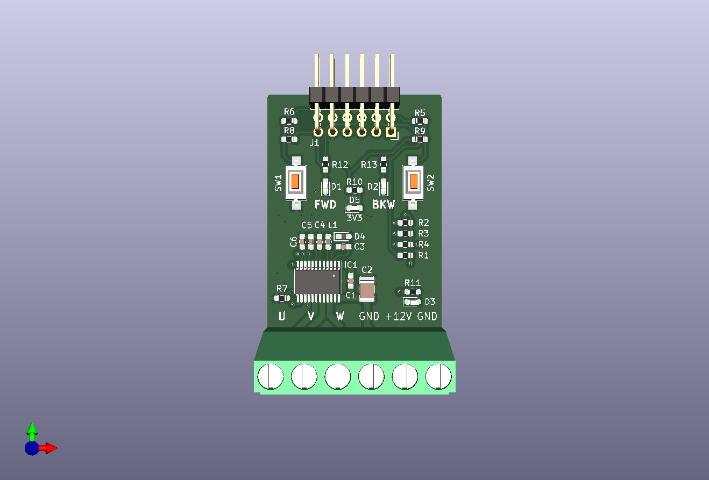
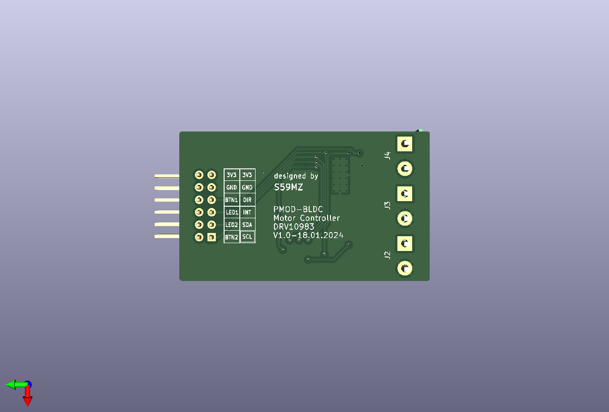

# kicad-pmod_bldc
PMOD PCB module with DRV10983 device for driving a Brush Less DC (bldc) Motor 

Schematic:
[kicad-pmod_bldc.pdf](kicad-pmod_bldc.pdf)

BOM:
[kicad-pmod_bldc.csv](kicad-pmod_bldc.csv)

Pick&Place:
[kicad-pmod_bldc.pos](kicad-pmod_bldc.pos)

Gerbers:
[gerbers.zip](https://github.com/s59mz/kicad-pmod_bldc/raw/main/gerbers.zip)
